<!-- ══════════════════════ BANNER ══════════════════════ -->

  

<!-- ══════════════════════ TYPING ANIMATION ══════════════════════ -->

 

<!-- ══════════════════════ BADGES ══════════════════════ 

&nbsp;
-->

 

---
## &nbsp;Connect with me

&nbsp;

&nbsp;

 

---

*✦ &nbsp;"The cosmos is within us. We are made of star-stuff." &nbsp;— Carl Sagan &nbsp;✦*

 

